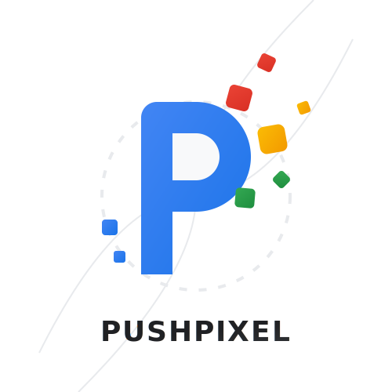

# PushPixel

<p align="center">
  
</p>

Auto-uploads photos and videos from local folders to Google Photos.
Runs as a daemon — set it and forget it.

## Features

- Monitors folders for new and modified media
- One-way sync to your main Google Photos library
- Resumable uploads for files over 50 MB
- Exponential backoff with jitter on rate limits
- Auto-retry for transient failures (configurable max attempts)
- Local SQLite state tracking across restarts
- Web dashboard with live stats, error details, and retry controls
- Runs as a background daemon or Docker container
- Windows and Linux binaries (amd64 + arm64 for Raspberry Pi)
- Docker image published to GitHub Container Registry

## How It Works

PushPixel scans your configured folders on a schedule and uploads media to Google Photos
in two steps: raw byte upload (or resumable upload for large files), then a batch creation
call to register the media. Each file's state is tracked in a local SQLite database so it
won't be re-uploaded on subsequent scans.

- **New files** — discovered on the next scan, queued for upload
- **Modified files** — detected by size or timestamp change, re-uploaded
- **Transient failures** (network, rate limits) — auto-retried with exponential backoff
- **Permanent failures** (file too large, invalid format) — marked as failed
- **Failed files** can be retried manually from the WebUI dashboard

## Prerequisites

- A **Google Account** — for OAuth 2.0 credentials (free, see [OAuth Setup](docs/oauth-setup.md))
- **Go 1.26+** or **Docker** — to build and run PushPixel
- Photos and videos in folders PushPixel can access

## Quick Start (Docker)

1. Clone the repo:
   ```
   git clone https://github.com/mainlink0435/pushpixel.git
   cd pushpixel
   ```
2. Create a minimal config:
   ```
   mkdir data
   ```
   Create `data/config.yaml` with just your OAuth credentials:
   ```yaml
   auth:
     client_id: "your-client-id"
     client_secret: "your-client-secret"
   ```
   Everything else defaults automatically for Docker (directories, DB path, logs, tokens).
3. [Set up OAuth credentials](docs/oauth-setup.md) and fill in the values above
4. Edit `docker-compose.yml` — change `/path/to/photos:/photos:ro` to point to your media directory
5. Start the container:
   ```
   docker compose up -d
   ```
6. Open `http://localhost:1978` — click **Connect to Google Photos**

> **Remote server?** PushPixel uses Desktop OAuth for simplicity — no redirect
> URIs to configure. The trade-off is Google always redirects back to
> `localhost`. If PushPixel runs on a different machine, when Google redirects
> to `http://localhost:1978/oauth/callback?...`, manually replace
> `localhost:1978` in the URL bar with your server's hostname and press Enter.
> Everything after `/oauth/callback?...` must stay unchanged.

## Quick Start (Without Docker)

1. Clone and configure as above
2. Build:
   ```
   go build -o pushpixel ./cmd/pushpixel/
   ```
3. Run:
   ```
   ./pushpixel -config config.yaml
   ```
4. Open `http://localhost:1978` — click **Connect to Google Photos**

## Configuration

All settings live in `config.yaml`. The key ones:

| Setting | Default | Description |
|---------|---------|-------------|
| `directories` | *(required)* | Folders to monitor for media |
| `file_extensions` | `.jpg .jpeg .png .webp .mp4 .mov` | File types to watch (case-insensitive) |
| `polling.interval` | `5m` | How often to scan for new/changed files |
| `retry.max_attempts` | `5` | Auto-retries before marking as permanently failed |
| `upload.max_concurrent` | `2` | Maximum parallel byte uploads |
| `upload.batch_size` | `50` | Items per batch creation call (max 50, API limit) |
| `webui.port` | `8080` | Dashboard port |
| `auth.client_id` | *(required)* | Google OAuth client ID |
| `auth.client_secret` | *(required)* | Google OAuth client secret |

See `config.example.yaml` for every option with comments.

## Docker Compose Reference

The included `docker-compose.yml`:

```yaml
services:
  pushpixel:
    image: ghcr.io/mainlink0435/pushpixel:latest
    container_name: pushpixel
    restart: unless-stopped
    ports:
      - "1978:1978"
    volumes:
      - ./data:/app/data    # config, db, logs, tokens
      - /path/to/photos:/photos:ro
    environment:
      - PUSHPIXEL_DOCKER=1
```

All runtime files live in `./data/` on your host:

| File | Purpose |
|------|---------|
| `data/config.yaml` | Config with OAuth credentials and directories |
| `data/pushpixel.db` | SQLite database tracking upload state |
| `data/token.enc` | Encrypted OAuth refresh token |
| `data/pushpixel.log` | Structured JSON logs with rotation |

The `PUSHPIXEL_DOCKER=1` environment variable tells PushPixel to use Docker-safe default
paths (`/app/data/` for DB, logs, and tokens; `/photos` for monitored directories).

## Web Dashboard

Once running, open `http://localhost:1978`. The dashboard shows:

| Stat | Meaning |
|------|---------|
| **Total tracked** | All files PushPixel has discovered |
| **Uploaded** | Successfully in Google Photos |
| **Remaining** | Still in the upload queue |
| **Failed** | Could not be uploaded — click to see error details |
| **Retry Failed Files** | Resets all failed files for another attempt |

Stats refresh every 5 seconds. When `Failed` is non-zero, a **Show** link appears next to
the count. Click it to list each failed file with its error message.

## Data and Storage

PushPixel creates these files in its working directory:

| File | Contents |
|------|----------|
| `pushpixel.db` | SQLite database tracking every file's upload state |
| `token.enc` | Encrypted OAuth 2.0 refresh token (machine-bound, survives restarts) |
| `pushpixel.log` | Structured JSON logs with rotation |

None of these contain your photos — just metadata about what's been uploaded.

## Limitations

- **Cannot see pre-existing library** — The Google Photos API only shows files PushPixel
  itself has uploaded. Files already in Google Photos from other sources (Drive sync,
  mobile uploads, web) will be re-uploaded. Google silently deduplicates identical bytes
  server-side, so no storage is wasted, but bandwidth is.

- **No album support** — All media goes to your main Google Photos timeline. Folder
  structure is not preserved.

- **Path-based identity** — Files are tracked by absolute path. Renaming or moving a
  file within a monitored directory treats it as a new file and re-uploads it.

- **Set-and-forget** — PushPixel only uploads. Deleting a file locally does not remove
  it from Google Photos.

## Documentation

- [Product Brief](docs/product-brief.md) — What PushPixel does and why
- [OAuth Setup](docs/oauth-setup.md) — Step-by-step Google Cloud credential setup
- [API Investigation](docs/api-investigation.md) — Google Photos API details and
  deduplication tradeoffs

## Troubleshooting

| Symptom | Likely cause | Fix |
|---------|-------------|-----|
| "unverified app" at sign-in | No test users added | Add your email under [Auth Platform - Audience](docs/oauth-setup.md) |
| "Not authenticated" on restart | Token expired or missing | Open `http://localhost:1978` and reconnect |
| Stats show all zeros | First scan hasn't run yet | Wait for the polling interval (default 5 min) |
| Files re-upload on each restart | Old database with stale state | Delete `pushpixel.db` and restart fresh |
| "database is locked" errors | Old database from earlier version | Delete `pushpixel.db` and restart |
| Files already in Google Photos re-upload | API limitation | Expected behaviour — see [Limitations](#limitations) |

## License

GPL-3.0 — see [LICENSE](LICENSE)
